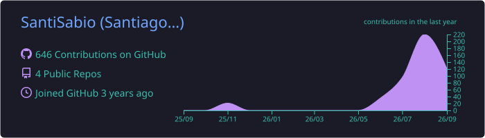
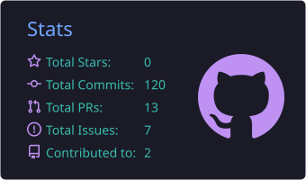
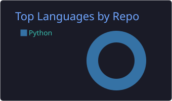
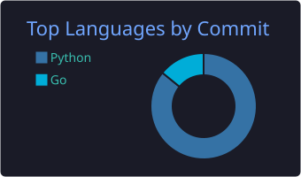

<h1 align="center">Hola 👋, soy Santiago Sabio</h1>

<h3 align="center">Estudiante de Ingeniería en Sistemas en la UTN · Pasantías en <b>Infinito Sistemas</b></h3>

## 🚀 Sobre mí

- 🔭 Actualmente desarrollo en **Planning**: sistema de gestión de órdenes de entrega de vehículos para concesionarias (Django 6 + DRF + PostgreSQL, con pantallas TV para sala de ventas)
- 📺 También en **PescadoresTV** (Django): app de gestión de contenido multimedia para pantallas
- 🌲 Formándome en desarrollo backend con Python

## 🛠️ Tecnologías

## 📌 Proyectos
- **Planning** — Gestión de órdenes de entrega de vehículos: planificación de entregas, controles de calidad por sucursal y pantallas TV. Django 6, DRF, PostgreSQL, Azure AD, HTMX + Bootstrap, CI con GitHub Actions y deploy en producción con Gunicorn + Nginx.
- **PescadoresTV** — Gestión de contenido multimedia para pantallas: subida, organización y programación de fotos y videos.

## 📊 Estadísticas de GitHub

| | |
| --- | --- |
|  |  |
|  |  |

Las tarjetas se regeneran automáticamente todos los días con un GitHub Action.

## 🤝 Conectá conmigo

